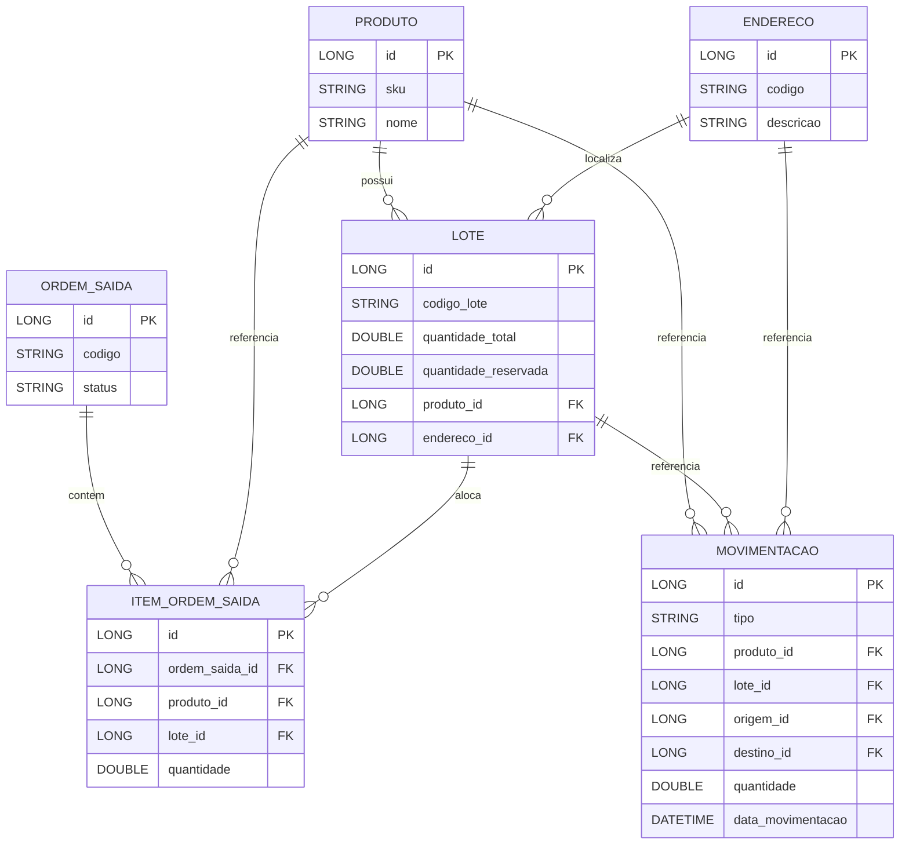
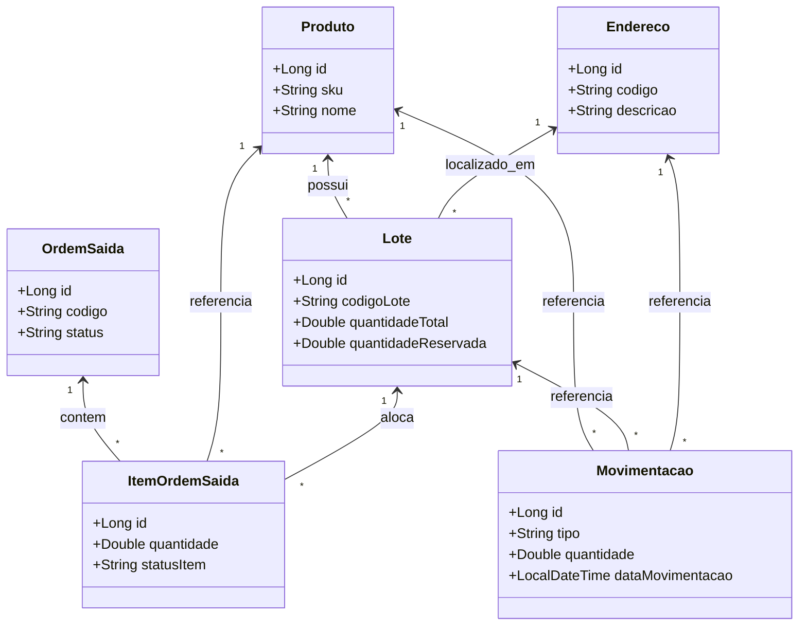

# dev_fullstack_miniwms

Mini WMS (Warehouse Management System) — projeto demo fullstack para gestão de lotes, ordens de saída e movimentações.

Desenvolvido por gustavo 

## Propósito

- Servir como exemplo de aplicação fullstack Java/Spring Boot com camadas bem separadas (controller, service, repository), templates Thymeleaf e um frontend leve.
- Cobrir operações básicas: cadastro de produtos, lotes, endereços; reservas e despacho de ordens de saída; registro de movimentações (entrada/saída/transferência).
- Facilitar aprendizagem de conceitos de WMS e integração entre camadas.

## Como rodar (resumo)

Pré-requisitos: Java 17+, Maven, banco de dados configurado (ex.: H2, PostgreSQL) e variáveis de ambiente conforme `application.properties`.

Executar:

```bash
cd projeto_teste_demo
mvn spring-boot:run
# acessar: http://localhost:8080
```

## Arquitetura (visão por camadas)

- Controller (MVC + REST): endpoints e templates — pacotes `controller`.
- Service: regras de negócio, alocação de lotes, reservas, confirmações — pacotes `service`.
- Repository: interfaces JPA (`JpaRepository`) — pacotes `repository`.
- Model (domain): entidades JPA como `Produto`, `Lote`, `OrdemSaida`, `ItemOrdemSaida`, `Movimentacao`, `Endereco` — pacotes `model`.
- Templates: Thymeleaf em `src/main/resources/templates` para as views web.

Fluxo típico (resumido): criar `OrdemSaida` → reservar quantidades em `Lote` (incrementa `quantidadeReservada`) → confirmar/despachar ordem (decrementa `quantidadeTotal` e `quantidadeReservada`) → criar registros em `movimentacao`.

## MER / ERD

O diagrama abaixo é uma representação simplificada das principais entidades e relacionamentos.



Observação: a implementação persiste identificadores legíveis (`produtoIdentificador`, `loteIdentificador`, `origemIdentificador`, `destinoIdentificador`) e também colunas numéricas (`produto_id`, `lote_id`, `origem_id`, `destino_id`) para facilitar consultas e integridade referencial.

O arquivo original do ERD está em [diagrams/erd.mmd](diagrams/erd.mmd).

## Diagrama UML (classes domain principais)

Classe simplificada em Mermaid (exibe relações principais):



O diagrama UML completo também está disponível em [diagrams/seq_confirmacao.mmd](diagrams/seq_confirmacao.mmd) e [diagrams/seq_reserva.mmd](diagrams/seq_reserva.mmd) (diagramas de sequência).

## Observações e boas práticas

- A pasta `src/` contém todo o código-fonte Java; mantenha apenas código e recursos essenciais no controle de versão.
- Arquivos grandes, binários e dumps (`.sql`, `target/`, `node_modules/`, `*.mmd` exportados) estão no `.gitignore` para manter o repositório leve.
- Se for necessário publicar diagramas, mantenha os arquivos fontes `.mmd` (mermaid) — eles são pequenos e fáceis de manter em controle de versão; se preferir, exporte PNG para documentação externa.

## Contato / próximo passo

Se quiser, eu posso:
- Gerar um `CONTRIBUTING.md` com guidelines.
- Criar um script de CI básico (`.github/workflows/maven.yml`).
- Exportar os diagramas em PNG e adicioná-los à documentação.

## Persistência (JPA / Hibernate)

Esta aplicação usa Spring Data JPA (`JpaRepository`) para acesso a dados. O provedor JPA padrão é o Hibernate, que mapeia as entidades Java (ex.: `Produto`, `Lote`, `OrdemSaida`, `Movimentacao`) para tabelas do banco de dados e gerencia o ciclo de vida das entidades, caching e geração de DDL quando configurado.

- Onde olhar: procure por interfaces que estendem `org.springframework.data.jpa.repository.JpaRepository` no pacote `repository`.
- Configuração: propriedades de conexão e opções do Hibernate estão em `src/main/resources/application.properties` (por exemplo `spring.jpa.hibernate.ddl-auto`).
- O que o Hibernate faz, sucintamente: converte consultas e operações sobre objetos Java em SQL, controla o estado (transient, persistent, detached), e facilita o mapeamento objeto-relacional.

Em desenvolvimento o projeto pode usar `spring.jpa.hibernate.ddl-auto=update` para criar/atualizar o schema automaticamente; em produção prefira migrações explícitas (Flyway/Liquibase).


## Docker

Fornecemos um `Dockerfile` e `docker-compose.yml` para executar a aplicação em contêineres (aplicação + PostgreSQL). As instruções abaixo explicam as opções:

1) Build e run com Docker (apenas a aplicação):

```bash
# a partir da raiz do projeto
docker build -t dev_fullstack_miniwms:latest .
docker run -p 8080:8080 \
  -e SPRING_DATASOURCE_URL=jdbc:postgresql://host.docker.internal:5432/miniwms \
  -e SPRING_DATASOURCE_USERNAME=wms \
  -e SPRING_DATASOURCE_PASSWORD=wms_password \
  dev_fullstack_miniwms:latest
```

2) Recomendo usar `docker-compose` para subir a aplicação com um banco Postgres local (mais simples para desenvolvimento):

```bash
docker-compose up --build
# acessar: http://localhost:8080
```

O `docker-compose.yml` padrão usa as variáveis:
- `POSTGRES_USER=wms`
- `POSTGRES_PASSWORD=wms_password`
- `POSTGRES_DB=miniwms`

e configura `SPRING_JPA_HIBERNATE_DDL_AUTO=update` para criar/atualizar o schema automaticamente. Em produção não use `update` — prefira migrações explícitas com Flyway/Liquibase.

3) Parar e remover containers/volumes:

```bash
docker-compose down -v
```

Problemas comuns:
- Se o contêiner da aplicação não consegue conectar ao banco, verifique logs: `docker-compose logs db` e `docker-compose logs app`.
- Ajuste `application.properties` ou as variáveis de ambiente para apontar para um banco existente.

Se quiser, eu posso também:
- Adicionar um `Dockerfile` otimizado (slim, com camada non-root user).
- Adicionar healthchecks e readiness probes ao `docker-compose`.
- Gerar um `Makefile` com comandos convenientes (`make docker-up`, `make docker-down`).
